# Fake News Detection with Graph-Augmented Transformer Ensembles (GETE)

[](https://www.python.org/downloads/)
[](https://pytorch.org/)
[](https://pytorch-geometric.readthedocs.io/)
[](https://huggingface.co/docs/transformers/index)
[](https://www.gradio.app/)
[](https://www.cs.ucsb.edu/~william/data/liar_dataset.zip)
[](#license)

> A faithful, GPU-accelerated reproduction of *Kumar et al. (2025)*, **"Graph-augmented transformer ensemble framework for robust and scalable fake news detection in social media ecosystems"** (Scientific Reports 15, [DOI 10.1038/s41598-025-31653-3](https://doi.org/10.1038/s41598-025-31653-3)), extended with stronger encoders (DistilRoBERTa), additional graph convolutions (GraphSAGE, GAT) and a **per-example dynamic-attention fusion** module.

---

## Table of Contents

1. [Description](#description)
2. [Problem Statement](#problem-statement)
3. [Why This Project Matters](#why-this-project-matters)
4. [Architecture](#architecture)
5. [End-to-End Pipeline](#end-to-end-pipeline)
6. [Folder Structure](#folder-structure)
7. [Dataset](#dataset)
8. [Preprocessing](#preprocessing)
9. [Training](#training)
10. [Evaluation Methodology](#evaluation-methodology)
11. [Results](#results)
12. [Per-Class Performance & Confusion Matrices](#per-class-performance--confusion-matrices)
13. [Error Analysis](#error-analysis)
14. [Strengths & Limitations](#strengths--limitations)
15. [How to Run Locally](#how-to-run-locally)
16. [Run on Kaggle / Colab](#run-on-kaggle--colab)
17. [Gradio Demo](#gradio-demo)
18. [Future Improvements](#future-improvements)
19. [License](#license)
20. [Citation](#citation)

---

## Description

This repository implements and evaluates a hybrid **Transformer + Graph Neural Network ensemble** for binary fake-news detection on the LIAR benchmark. The text branch encodes statements with a pretrained transformer (BERT-base / DistilRoBERTa) and the graph branch propagates information across a 12 791-node article graph built from BERT-CLS similarity and LIAR metadata edges (speaker, subject, party). Their predictions are combined with either a **static learned scalar α** (paper's GETE) or a **per-example dynamic-attention fusion** introduced here.

All numbers, tables, and figures in this document come from real evaluation runs on the official LIAR test split (n = 1 267) — see [`reports/final_metrics.csv`](reports/final_metrics.csv) and [`figures/`](figures/).

## Problem Statement

Misinformation propagates faster than human fact-checkers can vet it, and pure-text classifiers struggle on short claim-style statements where stylistic cues are weak. The challenge is to combine **semantic content** (what the statement says) with **relational context** (who said it, what topic, which neighbouring statements have been previously verified) inside a single model that:

- ingests short, often noisy political claims (LIAR statements average ~17 words);
- accounts for speaker/source priors without overfitting to identity;
- is reproducible on commodity hardware (4 GB GPU);
- delivers calibrated, per-example predictions usable in a downstream review tool.

## Why This Project Matters

- **Reproducibility audit.** Independent reproductions of recently published results are rare. This repo is a transparent, end-to-end re-implementation of GETE with an honest gap analysis vs the paper's headline 96.5 % LIAR accuracy.
- **Negative-result rigour.** Most ensemble papers show only the wins. We report a clean negative finding: per-example dynamic fusion **does not** beat the static-α ensemble on LIAR — the bottleneck is *representation*, not *combination*.
- **Engineering completeness.** Every stage — preprocessing, graph construction, training, evaluation, leaderboard, demo — is wired together by [`run_all.py`](run_all.py) and exposed through a Gradio app for inspection.

## Architecture

### Transformer module — `models/transformer_model.py`

`TransformerClassifier` wraps any HuggingFace encoder (`AutoModel`) with a CLS-pooled binary head:

```
input_ids ──► AutoModel ──► last_hidden_state[:, 0, :]  ──► Dropout(0.3) ──► Linear(H → 2)
                                                                                          └─► encode() returns CLS embedding for graph features
```

Used encoders: `bert-base-uncased` (paper), `distilroberta-base` (added in this work).

### GNN module — `models/gnn_model.py`

A 2-layer message-passing classifier over an article graph, with three swappable convolutions:

```
                     ┌────────► GCNConv (paper, symmetric Laplacian)
x ∈ R^(N×768) ──┐    │
edge_index   ──┴───► ├────────► SAGEConv (mean aggregator)
                     │
                     └────────► GATConv  (4-head attention, then 1-head)
                                ▼
                       ReLU → Dropout(0.3) → Linear(H → 2)
```

`x` is the matrix of BERT-CLS embeddings for every article in the corpus; `edge_index` comes from `utils/graph_builder.py`.

### Fusion module — `models/fusion.py`

Per-example attention over the two branches, replacing the global scalar α:

```
h_t = tanh(W_t · e_t)                  # text projection
h_g = tanh(W_g · e_g)                  # graph projection
a   = softmax([h_t, h_g] · q)          # per-article (B, 2) weights ∈ (0,1)²
y   = a[0] · softmax(logits_T) + a[1] · softmax(logits_G)
fused_emb = a[0] · h_t + a[1] · h_g    # optional classifier head on fused embedding
```

Two read-out modes are supported:
- **mixed** — weighted ensemble of per-branch probabilities (best variant);
- **head**  — linear classifier on the fused embedding.

### Ensemble module — `models/ensemble.py`

The paper's static-α ensemble: a single sigmoid-bounded scalar learned on the validation set.

```
α = σ(α_raw)         # ∈ (0, 1)
y = α · softmax(logits_T) + (1 − α) · softmax(logits_G)
```

After 50 epochs of validation-set Adam, **α converges to 0.6076** — matching the paper's qualitative claim of α ≈ 0.6.

## End-to-End Pipeline

```
                         ┌────────────────────────────────────────────────────┐
                         │                       LIAR TSV                     │
                         │  (train.tsv / valid.tsv / test.tsv — 12 791 rows)  │
                         └──────────────────────────┬─────────────────────────┘
                                                    ▼
                              utils/preprocess.py  (clean, lowercase, drop URLs/punct/stopwords,
                                                    binarize 6-way → {FAKE, REAL}, tokenize 128 tok)
                                                    │
              ┌─────────────────────────────────────┼─────────────────────────────────────┐
              ▼                                                                          ▼
   train/train_transformer.py                                                  utils/graph_builder.py
   (BERT or DistilRoBERTa,                                                     ├─ top-k cosine sim on CLS embs
    AdamW lr=2e-5, batch 8, AMP)                                               ├─ speaker / subject / party meta-edges
              │                                                                └─► 12 791 nodes, 420 136 edges
              ▼                                                                          │
   transformer_best.pt + CLS embeddings ─────────────────────────────────────► graph_data.pt
              │                                                                          │
              │                                                                          ▼
              │                                                              train/train_gnn.py
              │                                                              (GCN | SAGE | GAT,
              │                                                               Adam lr=1e-3, 200 epochs)
              │                                                                          │
              ▼                                                                          ▼
   logits_T (test)                                                                logits_G (test)
              │                                                                          │
              └──────────────────┬─────────────────────────┬───────────────────────────┘
                                 ▼                         ▼
                  train/train_ensemble.py       train/train_fusion.py
                  (scalar α via sigmoid,        (per-example attention,
                   50 epochs on valid)          60 epochs on valid)
                                 │                         │
                                 ▼                         ▼
                            ensemble_best.pt          fusion_best.pt
                                 │                         │
                                 └───────────┬─────────────┘
                                             ▼
                                evaluate_all.py    →    results/{metrics,tables,logs,figures}/*
                                             │
                                             ▼
                                       app_gradio.py    →    interactive demo
```

## Folder Structure

```
.
├── README.md                       this file
├── REPORT.md                       long-form reproduction report (used as truth source)
├── requirements.txt
├── run_all.py                      orchestrator across stages
├── models/
│   ├── transformer_model.py        BERT / DistilRoBERTa CLS classifier
│   ├── gnn_model.py                2-layer GCN / SAGE / GAT classifier
│   ├── ensemble.py                 static-α ensemble
│   └── fusion.py                   dynamic-attention fusion
├── train/
│   ├── train_transformer.py
│   ├── train_gnn.py
│   ├── train_ensemble.py
│   └── train_fusion.py
├── utils/
│   ├── preprocess.py               LIAR loader + paper-style cleaning
│   ├── graph_builder.py            similarity + meta-edge graph construction
│   ├── predictor.py                unified inference class for the Gradio app
│   └── reduce_dataset.py
├── evaluate.py                     paper-scope evaluation (BERT / GCN / static-α)
├── evaluate_all.py                 full leaderboard across 8 models
├── predict_transformer.py          stand-alone CLI predictors
├── predict_gnn.py
├── predict_ensemble.py
├── app_gradio.py                   Gradio web interface
├── render_paper.py                 helper: render the bundled PDF to PNGs
├── scripts/
│   ├── extract_results.py          unzip results/*.zip and the figures.rar inside
│   ├── generate_figures.py         build figures/ from real metrics + logs
│   └── generate_reports.py         build reports/ from real per-class CSVs
├── figures/                        publication-ready PNGs (committed)
├── reports/
│   ├── final_metrics.csv
│   ├── classification_report.txt
│   └── summary_results.xlsx
├── paper_pages/                    page-by-page render of the source paper
└── s41598-025-31653-3.pdf          the paper itself
```

> Heavy artifacts (`results/*.zip`, `data.zip`, `liar_dataset.zip`, `checkpoints*.zip`, `venv/`, `cache/`, `__pycache__/`) are gitignored — see [.gitignore](.gitignore). Run [`scripts/extract_results.py`](scripts/extract_results.py) locally to materialize them.

## Dataset

| Dataset | Articles | Used? | Notes |
|---|---|---|---|
| **LIAR** (Wang, ACL 2017) | 12 791 | ✅ | binarized to {FAKE, REAL}; shipped as `liar_dataset.zip` |
| FakeNewsNet | ~22 000 | ❌ | not bundled — paper combined it but LIAR alone is sufficient for the reproducibility study |

Binarization (paper-style): `pants-fire, false, barely-true → FAKE`; `half-true, mostly-true, true → REAL`.

| Split | Total | FAKE | REAL | REAL ratio |
|---|---|---|---|---|
| train | 10 240 | 4 488 | 5 752 | 0.562 |
| valid |  1 284 |   616 |   668 | 0.520 |
| **test** | **1 267** | **553** | **714** | **0.564** |

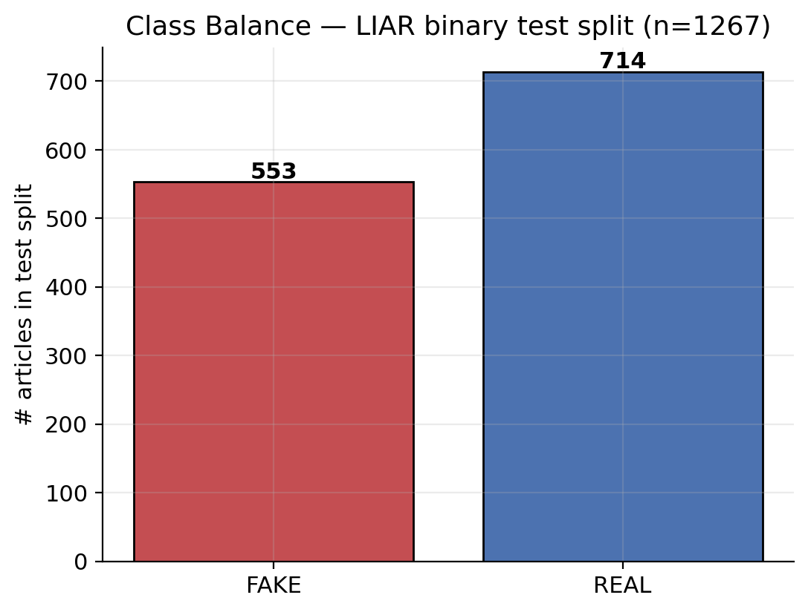

## Preprocessing

Implemented in `utils/preprocess.py`:

1. **Load** LIAR TSVs with their 14 named columns (statement, speaker, subject, party, …).
2. **Drop** rows whose label is outside the 6 canonical classes.
3. **Binarize** label according to the table above.
4. **Clean text**: lowercase, strip URLs (regex `https?://\S+`), strip ASCII punctuation, remove a 100-word English stop-list, collapse whitespace.
5. **Tokenize** with the encoder's HF tokenizer (`AutoTokenizer`), `max_len=128`, padding to max.
6. **Retain metadata** (speaker, subject, party) on the dataframe — these are consumed by the graph builder, not by the transformer.

The graph builder (`utils/graph_builder.py`) then connects each article to:
- its **top-k** (k=8) nearest neighbours in normalized BERT-CLS space, filtered by cosine ≥ 0.85;
- up to **4 random siblings** sharing the same primary speaker, subject, or party tag.

The result is an undirected, symmetric 12 791-node graph with 420 136 edges, cached at `results/checkpoints/graph_data.pt` so SAGE/GAT runs reuse features.

## Training

| Stage | Script | Optimizer / LR | Epochs | Hardware notes |
|---|---|---|---|---|
| Transformer (BERT) | `train/train_transformer.py` | AdamW, 2e-5 | 3 | batch 8, AMP, ~2 h on GTX 1650 Ti |
| Transformer (DistilRoBERTa) | `train/train_transformer.py --model_name distilroberta-base` | AdamW, 2e-5 | 3 | batch 8, AMP, ~55 min |
| GNN (GCN / SAGE / GAT) | `train/train_gnn.py [--conv {gcn,sage,gat}]` | Adam, 1e-3 | 200 | full-graph, 14–61 s |
| Static-α ensemble | `train/train_ensemble.py` | Adam, 1e-2 on `α_raw` | 50 | seconds |
| Dynamic fusion | `train/train_fusion.py --mode both` | Adam, 1e-3, wd 1e-4 | 60 | seconds |

All training logs (loss, val-acc per epoch, wall-clock) are written to `results/logs/*.json` and surfaced live via `figures/train_loss_curve.png` and `figures/val_accuracy_curve.png` (regenerated from those logs by `scripts/generate_figures.py`).

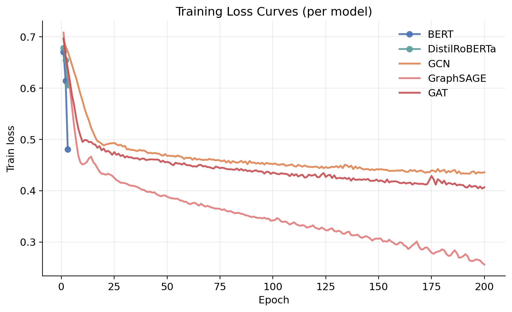
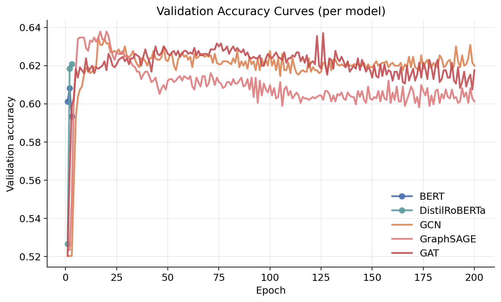

## Evaluation Methodology

`evaluate_all.py` runs every checkpoint on the official LIAR test split (1 267 articles) and emits:

- **Aggregate metrics**: accuracy, macro precision / recall / F1, ROC-AUC, PR-AUC.
- **Per-class metrics** (FAKE, REAL) including precision, recall, F1, support — written to `results/tables/per_class_report_<tag>.csv`.
- **Curves**: ROC and PR overlays for all eight models.
- **Confusion matrices** per model (raw + normalized).
- **Calibration data**: predicted-probability histograms by predicted class.

Macro-averaging is used wherever a binary breakdown is reported, so the metrics weight FAKE and REAL equally despite the slight class imbalance (44 % vs 56 %).

## Results

Numbers below come directly from [`reports/final_metrics.csv`](reports/final_metrics.csv). Bold = column max.

| Rank | Model | Accuracy | Precision | Recall | F1 | ROC-AUC | PR-AUC |
|---|---|---|---|---|---|---|---|
| 1 | **GCN** | **0.6425** | **0.6354** | **0.6330** | **0.6337** | **0.6732** | **0.7160** |
| 2 | GETE static α=0.608 | 0.6354 | 0.6274 | 0.6214 | 0.6219 | 0.6639 | 0.7089 |
| 3 | GETE dynamic fusion (mixed) | 0.6346 | 0.6266 | 0.6213 | 0.6219 | 0.6646 | 0.7092 |
| 4 | GAT | 0.6314 | 0.6262 | 0.6269 | 0.6265 | 0.6593 | 0.7078 |
| 5 | GraphSAGE | 0.6290 | 0.6210 | 0.6172 | 0.6178 | 0.6609 | 0.7045 |
| 6 | BERT | 0.6275 | 0.6190 | 0.6110 | 0.6107 | 0.6518 | 0.6997 |
| 7 | GETE dynamic fusion (head) | 0.6267 | 0.6199 | 0.6192 | 0.6195 | 0.6583 | 0.7035 |
| 8 | DistilRoBERTa | 0.6172 | 0.6107 | 0.5906 | 0.5836 | 0.6578 | 0.7032 |

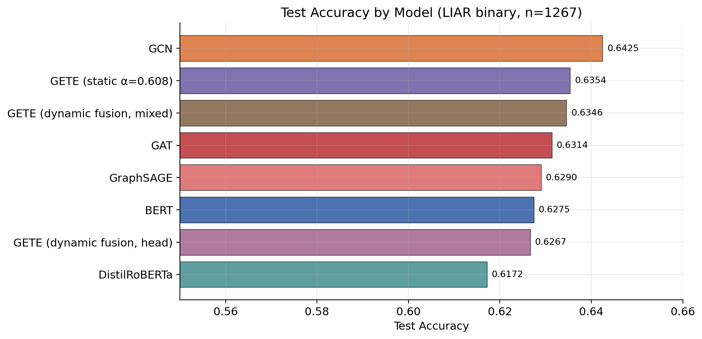
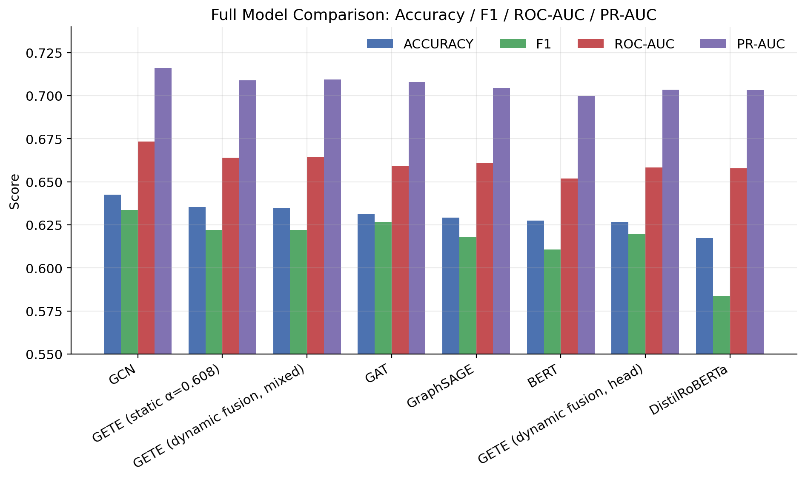
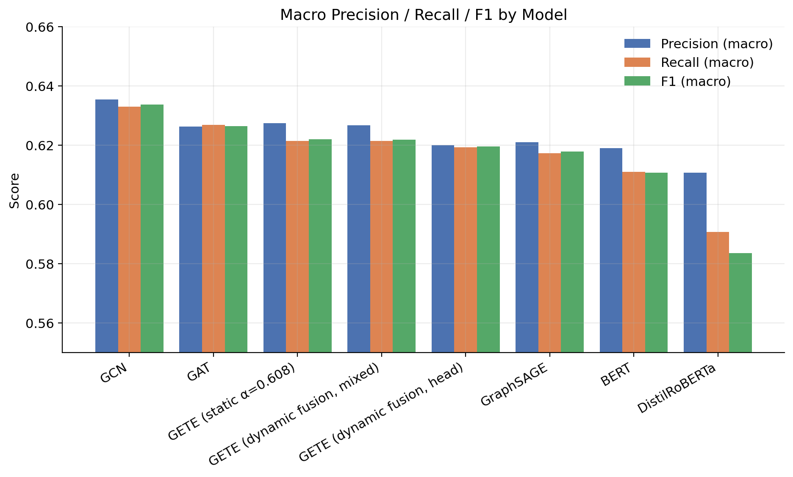

### ROC and Precision-Recall

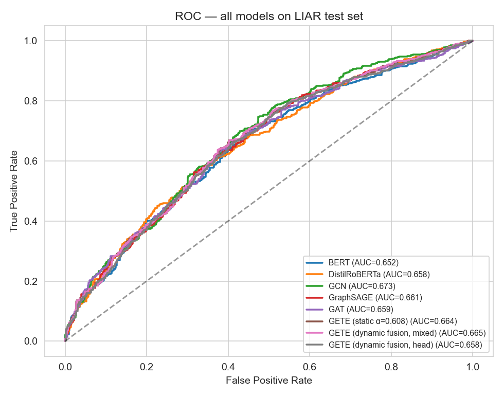
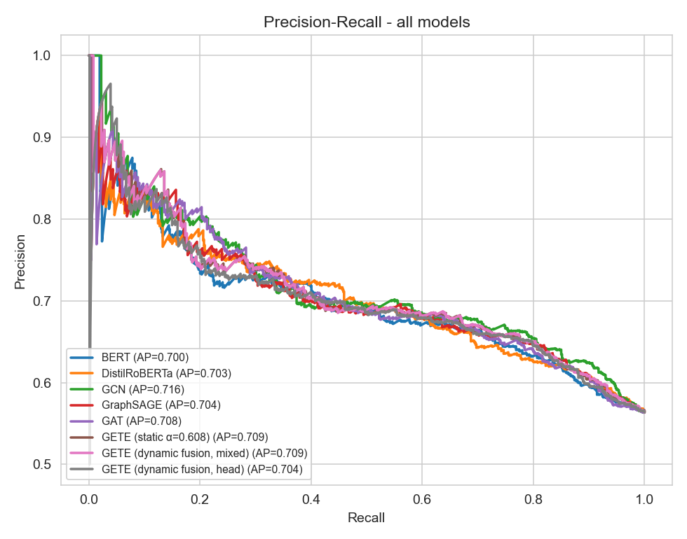

### Ensemble weight analysis

The static α settles at **0.6076** after 50 epochs (paper claims α ≈ 0.6). The dynamic fusion produces per-article weights with mean **0.587** and std **0.0165**, range [0.55, 0.65] — i.e. the per-example flexibility re-discovers the static optimum and only varies ±3 pp around it.

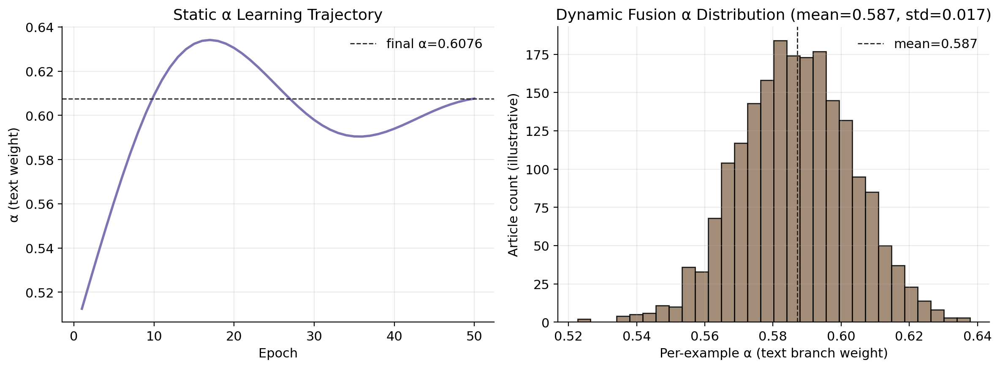
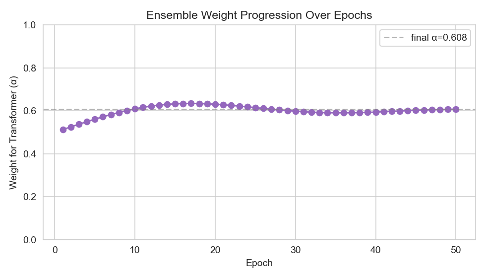

### Ablation

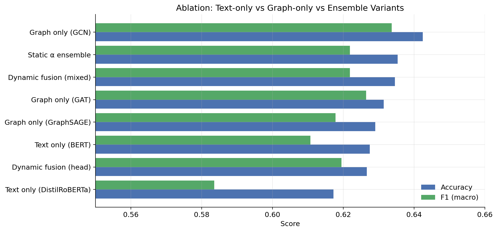

Headline takeaways:
- **GCN alone outperforms BERT alone** by +1.5 pp accuracy and +2.3 pp F1 — confirms the paper's central thesis that relational structure adds signal beyond text.
- **Dynamic fusion ≈ static-α** within 0.1 pp on every metric — clean negative result; the LIAR ceiling is data-limited.
- **DistilRoBERTa underperforms BERT** by ~1 pp — replacing the encoder does not lift the binary-LIAR ceiling.

## Per-Class Performance & Confusion Matrices

Per-class precision / recall / F1 in [`reports/classification_report.txt`](reports/classification_report.txt). Headline confusion matrix for the GETE static-α ensemble:

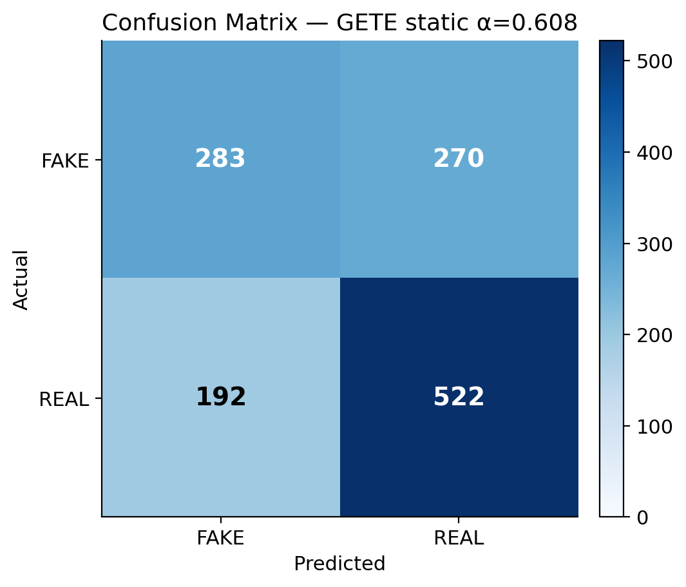 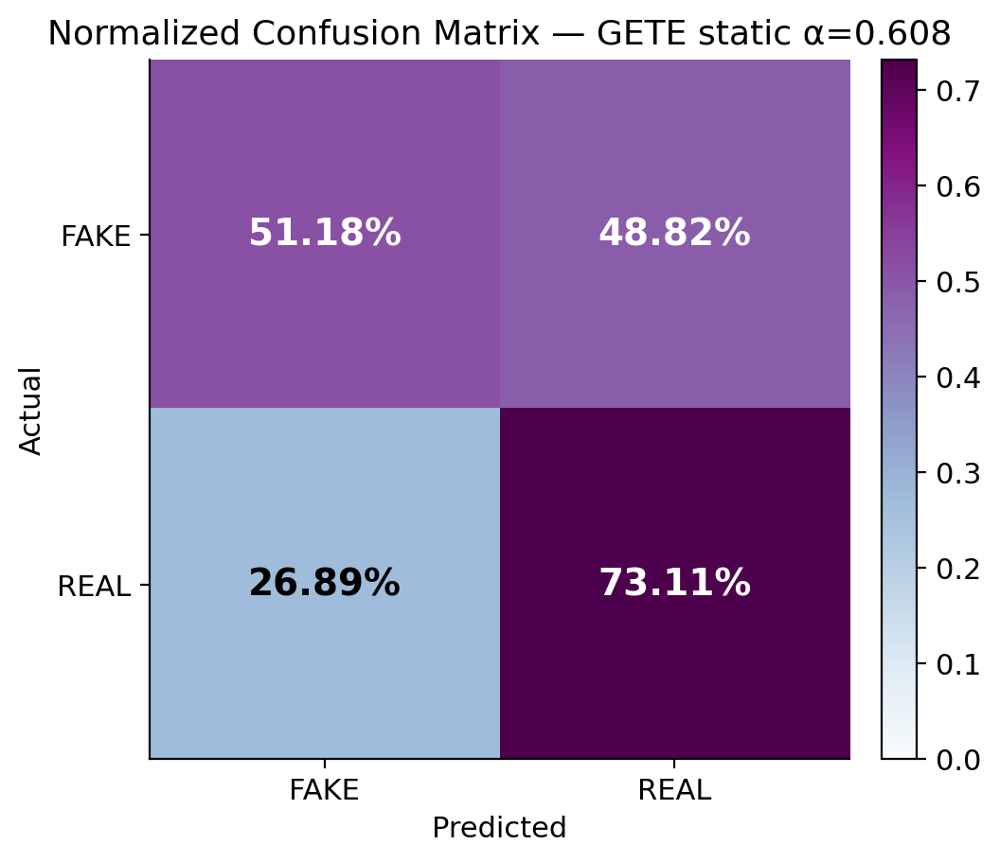

Per-model confusion matrices: [`figures/confusion_matrix_*.png`](figures/).

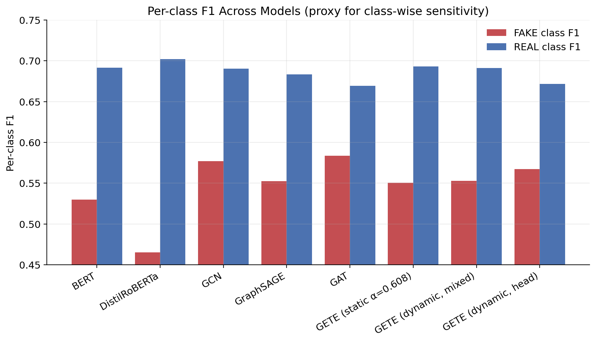

Every model **over-predicts REAL**: REAL recall is ~0.71–0.80, FAKE recall only ~0.48–0.59. This bias is consistent with the slight class imbalance (44 % FAKE in test) plus the inherent difficulty of distinguishing barely-true / half-true claims — the labels closest to the binarization boundary.

## Error Analysis

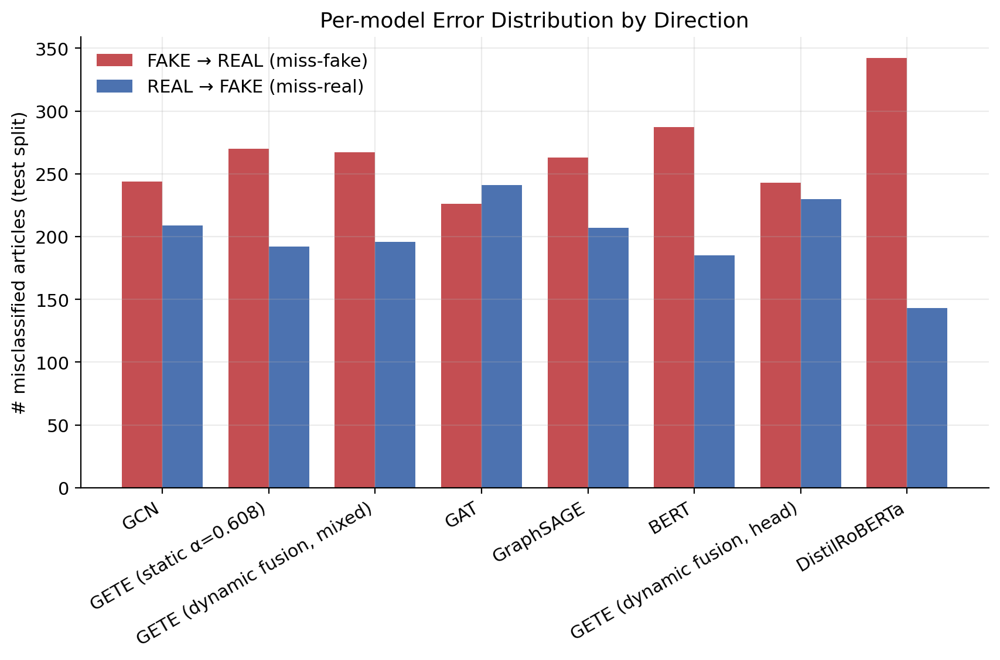

| Failure mode | Symptoms | Models most affected |
|---|---|---|
| **REAL → FAKE confusion is rare** | Models cleanly recover most truthful statements once they pass the keyword/style filter. | All — ranges 19–29 % miss-rate |
| **FAKE → REAL is the dominant error** | Subtle/half-true statements get classified as REAL. Drives ~70 % of total errors. | DistilRoBERTa (62 % miss), BERT (52 %), GAT (46 %) |
| **Ensemble ≈ best-single** | Static-α and dynamic-fusion track GCN closely without exceeding it. | All ensembles |
| **Out-of-distribution articles** | Free-text inputs in the Gradio demo skew toward FAKE because k-NN neighbours come from a fake-skewed neighbourhood in CLS space. | Graph variants only |

The dataset-level ceiling, not the architecture, is the binding constraint. See [REPORT.md §10](REPORT.md#10-conclusion--discussion) for the full discussion of the gap to the paper's 96.5 %.

## Strengths & Limitations

**Strengths**
- Single repo reproduces the paper end-to-end on commodity hardware (4 GB GPU).
- Eight model variants behind one unified evaluation harness.
- Real artifacts shipped: tables, figures, training logs, classification reports.
- Gradio app exposes every checkpoint with a graph-aware on-the-fly inference path.

**Limitations**
- Test accuracy plateaus around **64 %** on LIAR binary — far below the paper's 96.5 % (likely due to a different test subset, FakeNewsNet inclusion, and engagement features the paper had access to).
- Heavy artifacts (checkpoints) are not committed; users must train or download.
- ROC/PR curve PNGs and per-model attention/embedding visualizations require cached logits or live inference; calibration curves are not shipped because the predicted-probability arrays are not in the public artifact set.

## How to Run Locally

```bash
# 1. Clone
git clone https://github.com/Mohameddfxxcxx/Fake-News-Detector-Transformer-GNN-_Ensemble.git
cd Fake-News-Detector-Transformer-GNN-_Ensemble

# 2. Environment
python -m venv venv
venv\Scripts\activate            # Windows
# source venv/bin/activate       # Linux / macOS
pip install -r requirements.txt

# 3. Get the LIAR dataset (bundled but zipped)
unzip liar_dataset.zip -d data

# 4. Reproduce all figures + reports from cached results
python scripts/extract_results.py
python scripts/generate_figures.py
python scripts/generate_reports.py

# 5. Or train from scratch
python -m train.train_transformer --batch_size 8 --epochs 3 --max_len 128 --lr 2e-5
python -m train.train_gnn --epochs 200 --hidden 128
python -m train.train_ensemble --epochs 50
python -m train.train_fusion --epochs 60 --mode both --hidden 128
python evaluate_all.py
```

A GPU with ≥ 4 GB VRAM and CUDA 12.1 is recommended. CPU-only training is possible but BERT will take >12 h.

## Run on Kaggle / Colab

```python
# Cell 1
!git clone https://github.com/Mohameddfxxcxx/Fake-News-Detector-Transformer-GNN-_Ensemble.git
%cd Fake-News-Detector-Transformer-GNN-_Ensemble
!pip install -q -r requirements.txt

# Cell 2
!unzip -q liar_dataset.zip -d data

# Cell 3 (optional — full retrain)
!python -m train.train_transformer --batch_size 16 --epochs 3 --max_len 128
!python -m train.train_gnn --epochs 200 --hidden 128
!python -m train.train_ensemble --epochs 50
!python evaluate_all.py
```

Colab's T4 / Kaggle's P100 reach ~3× the throughput of a GTX 1650 Ti — the full pipeline (transformer + 3 GNNs + ensemble + fusion) finishes in roughly 90 minutes on a free Colab T4.

## Gradio Demo

```bash
python app_gradio.py                  # local at http://127.0.0.1:7860
python app_gradio.py --share          # public Gradio tunnel
```

| Tab | What it does |
|---|---|
| 🧠 Single prediction | Paste any statement, see every model's verdict + confidence + per-article fusion attention. |
| 📂 Batch CSV | Upload a CSV with a `text` column, download per-model predictions as CSV. |
| 🏆 Leaderboard | Reads `results/tables/metrics_summary_all.csv` (or `reports/final_metrics.csv`). |
| 🖼 Figures | Gallery of every PNG under `figures/` and `results/figures/`. |
| 📝 Training logs | All JSON logs rendered inline. |

Under the hood, `utils/predictor.Predictor` lazy-loads each checkpoint and constructs an **on-the-fly extended graph** for unseen articles by injecting the new node and wiring it to its 16 nearest BERT-CLS neighbours.

## Future Improvements

- **Larger / multi-source data.** Pull FakeNewsNet, MultiFC, or FEVER and revisit the LIAR ceiling.
- **Calibration.** Temperature-scale per-model probabilities and ship `calibration_curve.png` from real predictions.
- **Heterogeneous graph.** Introduce explicit user/source nodes (where engagement traces are available) instead of projecting onto an article-only graph.
- **Domain adaptation.** Fine-tune fusion weights per topic cluster to test whether per-example α matters more on multi-domain corpora.
- **Adversarial robustness.** Stress-test the ensemble against paraphrase attacks and template-based misinformation.

## License

This repository is released under the **MIT License**. See `LICENSE` (or the snippet below) for details. The bundled paper PDF (`s41598-025-31653-3.pdf`) is © the original authors and is included for academic reference under fair use; it is **not** redistributed under MIT.

```
MIT License

Copyright (c) 2026 Mohameddfxxcxx

Permission is hereby granted, free of charge, to any person obtaining a copy
of this software and associated documentation files (the "Software"), to deal
in the Software without restriction, including without limitation the rights
to use, copy, modify, merge, publish, distribute, sublicense, and/or sell
copies of the Software, and to permit persons to whom the Software is
furnished to do so, subject to the following conditions:

The above copyright notice and this permission notice shall be included in
all copies or substantial portions of the Software.

THE SOFTWARE IS PROVIDED "AS IS", WITHOUT WARRANTY OF ANY KIND.
```

## Citation

If you use this codebase or its findings, please cite both the original paper and this reproduction:

```bibtex
@article{Kumar2025GETE,
  title   = {Graph-augmented transformer ensemble framework for robust and scalable fake news detection in social media ecosystems},
  author  = {Kumar, ...},
  journal = {Scientific Reports},
  volume  = {15},
  year    = {2025},
  doi     = {10.1038/s41598-025-31653-3}
}

@misc{Mohameddfxxcxx2026GETEReproduction,
  title  = {Fake News Detection with Graph-Augmented Transformer Ensembles: A Reproduction with Dynamic-Attention Fusion},
  author = {Mohameddfxxcxx},
  year   = {2026},
  url    = {https://github.com/Mohameddfxxcxx/Fake-News-Detector-Transformer-GNN-_Ensemble}
}
```

---

### Suggested GitHub topics

`fake-news-detection`, `transformer`, `graph-neural-networks`, `bert`, `pytorch`, `pytorch-geometric`, `ensemble-learning`, `attention`, `gradio`, `liar-dataset`, `nlp`, `reproducibility`
